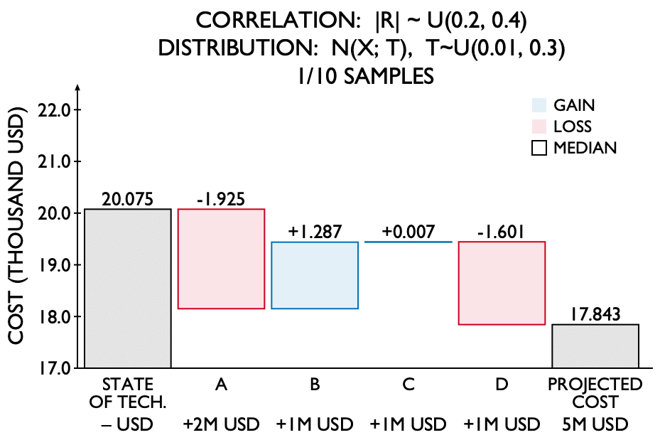

# Background

A waterfall plot shows the effects of sequential processes on a given metric.
Reminiscent of a bar chart, the first bar indicates the value of the metric at the beginning of a process and the last bar indicates its value at the process's end.
Each intermediate bar represents an increase or decrease in this metric due to the associated step in the process.

Waterfall plots are popular methods for conveying investment impact: which investment(s) might make the greatest difference?

Waterfall plots are unique in that they are inherently order-dependent.
When step one in the cascade is calculated and displayed, it has no information of any subsequent steps.
However, step two is both calculated and visualized with the knowledge of the results of step one, introducing a correlation between these steps.

## Order-Dependence

In the case of a strictly linear manufacturing process for which all steps must be performed in only one order, the plotting order will be fixed.
However, if any steps in the process could occur in a different order, this introduces a permutation of possible plotting orders.
Now, if step two is plotted before step one, any effects of step one on step two are lost, and the effects of step two on step one are gained.
Such is the case when making multiple investments simultaneously:
An improvement in one area might compound an improvement in another.
Or, one improvement might make another irrelevant altogether -- ex, Investment 1 lowers the cost of concrete, but Investment 2 removes the need for concrete altogether.

This Waterfall.jl graphics package provides support to visualize, with uncertainty, the impact of sequential investments on a given metric (i.e., cost, emissions).
The first column of the waterfall plot shows the value before any investment has been made, and each subsequent column shows the increase or decrease in value after a single investment until the final column shows the projected value after all investments have been made.
Waterfall plots are unique in that the order in which investments are plotted impacts both the shape of the graphic and the values of each individual result: each value encompasses the effects of not only the current investment, but of all investments before it.
The impact of any investments plotted after it, however, will not be included in the visualization.
This has the effect in obscuring correlations between investments and changing the results themselves as an artifact of decisions surrounding plotting order.
Furthermore, there is no currently accepted method of visualizing uncertainty in waterfall plots.

## Correlated Investments

Suppose we make four investments -- A,B,C,D -- that result in an increase or decrease in cost.
Suppose, also, that each investment is correlated such that each individual investment impacts the results of the other three investments.
If we swap the order of investments A and B, we notice the following changes:
1. A change in the overall plot shape, and
2. A change in the **perceived** impact of each individual investment -- A,B,C,D -- as well as the overall final cost.

If we move A such that it is the first, not the last investment, investment C now appears to **decrease** cost, rather than increase it as it did for the first two permutations (A-D sequentially; swapping A and B).

```@raw html
<table border="0" cellspacing="0" cellpadding="0">
<td style="text-align:center"><em>
    
        <br>Sequential ordering:
        <br>A,B,C,D
</em></td>
<td style="text-align:center"><em>
    
        <br>Permuted ordering:
        <br>B and A swapped
</em></td>
<td style="text-align:center"><em>
    
        <br>Permuted ordering:
        <br>A last
</em></td>
</tr></table>
```

## Uncertainty

Now, suppose that the **exact** impact of each investment is unknown, but rather is represented by *N* samples selected from a distribution.

```@raw html
<table border="0" cellspacing="0" cellpadding="0"><tr>
<td style="text-align:center"><em>
    
        <br>1 sample (no uncertainty)
</em></td>
<td style="text-align:center"><em>
    
        <br>10 random samples from a normal distribution
</em></td>
</tr></table>
```

When investment A is made at the end, rather than the beginning, its plot appears to be "fuzzier" when it is at the end than when it is at the beginning.
This is a result the compounding impacts of investments B, C, and D preceeding it.

```@raw html
<table border="0" cellspacing="0" cellpadding="0">
<td style="text-align:center"><em>
    
        <br>Sequential ordering:
        <br>A,B,C,D
</em></td>
<td style="text-align:center"><em>
    
        <br>Permuted ordering:
        <br>B and A swapped
</em></td>
<td style="text-align:center"><em>
    
        <br>Permuted ordering:
        <br>A last
</em></td>
</tr></table>
```

## Visualization Options

Given either randomly-generated samples or model output (with the results of each investment stored in a separate spreadsheet), the package calculates and draws the magnitude at each investment step.
The package also provides four visualization options to provide a user flexibility in how they want to display uncertainty:
1. Horizontal, all samples are overlaid with opacity;
2. Vertical, all samples are shown as individual bars;
3. Parallel, all samples are overlaid as lines from one investment to the next; and
4. Violin, a violin plot at each step is used to show individual investment impact by plotting the distribution of the cumulative investment metric after each investment has been made.

The Parallel- and Vertical-type plots are similar in that they preserve sample relationships: meaning that sample 1 in the state of technology is tied to sample 1 in investments A-D, and in the final projected metric.
The Vertical-type plot in particular shows that samples that might start out the largest are not consistently so as investments are made:
samples begin sorted by magnitude in the state of technology and become increasingly less sorted as investments are made.
This can be observed in the Parallel-type plot where lines intersect after investments.

The Horizontal- and Violin-type plots, however, overlay or aggregate samples, removing this level of detail from the visualization.
The Violin plot shows the distribution of sample values in the width of each investment's violin.
The Horizontal-type plot shows distribution as opacity, with darker and lighter outcomes more and less-likely to occur.

```@raw html
<table border="0" cellspacing="0" cellpadding="0">
<tr>
<td style="text-align:center"><em>
	
        <br>Horizontal
</em></td>
<td style="text-align:center"><em>
    
        <br>Vertical
</em></td>
</tr>
</table>
<table border="0" cellspacing="0" cellpadding="0">
<tr>
<td style="text-align:center"><em>
    
        <br>Violin
</em></td>
<td style="text-align:center"><em>
    
        <br>Parallel
</em></td>
</tr>
</table>
```

Additional customization options are available:
- **Explicit metrics.**
    There is the option to outline statistical values, with median sample value shown by default.
- **Coloring.**
    Users are given the option to assign plot color such that each investment step is uniquely colored or such that there is a distinction between gains and losses.
    Up to 10 investments can be shown with distinguishable colors.


```@raw html
<table border="0" cellspacing="0" cellpadding="0">
<tr>
<td style="text-align:center"><em>
    
</em></td>
<td style="text-align:center"><em>
    
</em></td>
</tr>
</table>
```